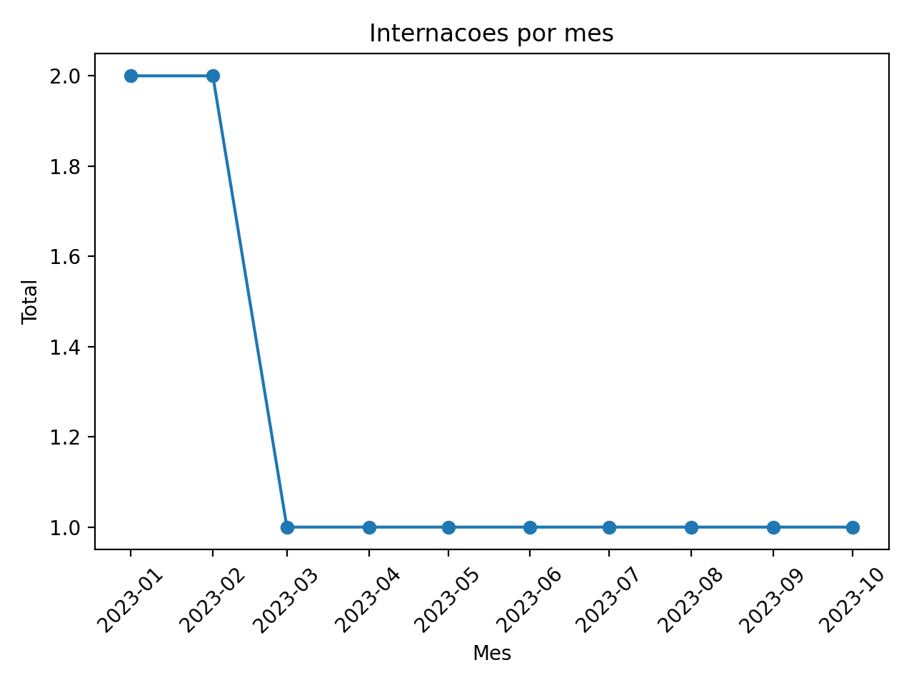
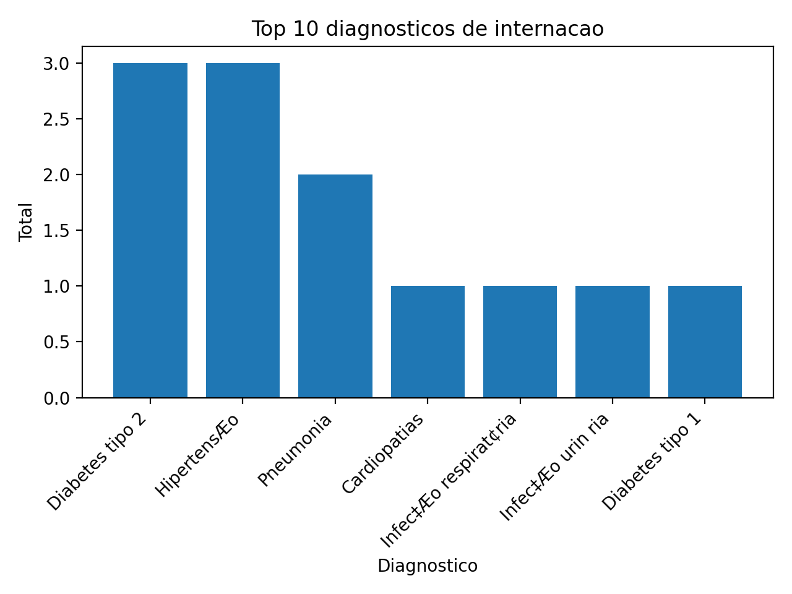
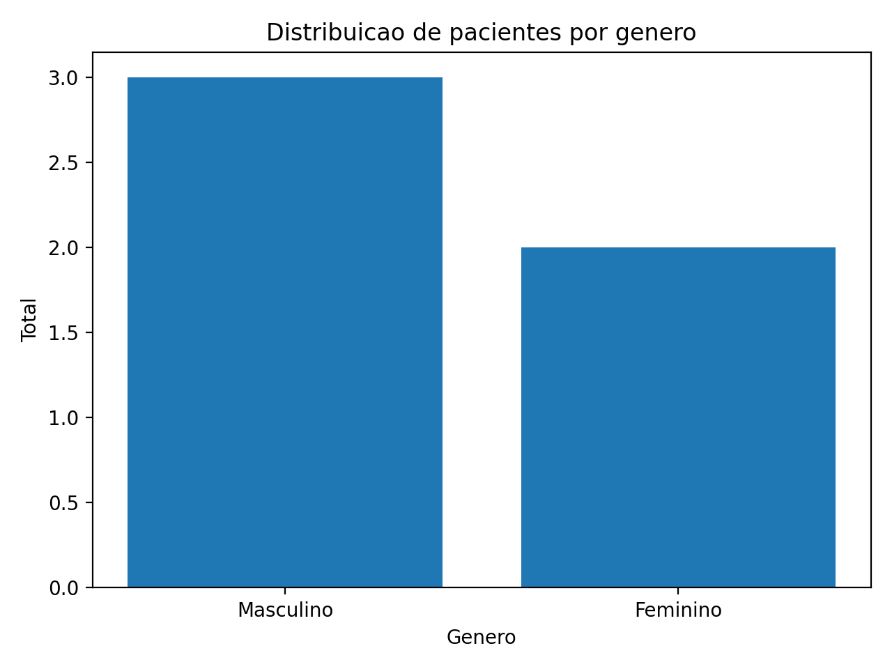
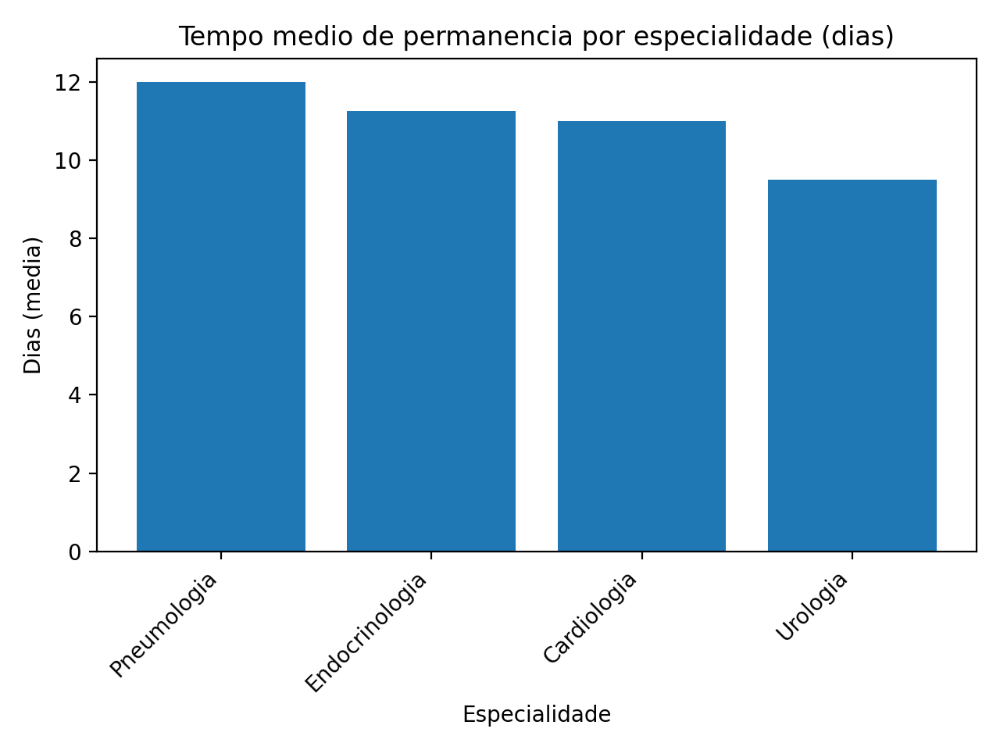

# 🏥 Hospital Data Analysis

Projeto de análise de dados hospitalares utilizando PostgreSQL e Python.

O objetivo é extrair indicadores relevantes sobre pacientes, doenças e internações, gerando relatórios e visualizações para apoio à decisão.

---

## 🚀 Tecnologias Utilizadas

- PostgreSQL
- Python
- Pandas
- Matplotlib
- SQL
- Psycopg2

--## 📂 Estrutura do Projeto

```text
HOSPITAL_DATA_ANALYSIS/
│
├── consultas.sql
│
├── dados/
│   ├── doencas.csv
│   ├── relatorio_hospitalar.xlsx
│   ├── tempo_internacao.csv
│   └── volume_pacientes.csv
│
├── scripts/
│   ├── docs/
│   ├── analise_dados.py
│   ├── conexao_postgresql.py
│   ├── consultas_sql.py
│   ├── gerar_graficos.py
│   └── gerar_relatorio.py
│
├── requirements.txt
└── README.md
```
---

## 📊 Análises Realizadas

✔ Volume de pacientes  
✔ Tempo médio de internação  
✔ Distribuição por gênero  
✔ Principais diagnósticos  
✔ Relatório hospitalar consolidado  

---

## 📈 Visualizações

### Internações por mês


### Top Diagnósticos


### Distribuição por gênero


### Tempo médio de permanência


---

## ▶ Como Executar

### 1) Instalar dependências
```bash
pip install -r requirements.txt
```
## 2) Rodar análises
```bash
python scripts/analise_dados.py
```
## 3) Gerar gráficos
```bash
python scripts/gerar_graficos.py
```

---


